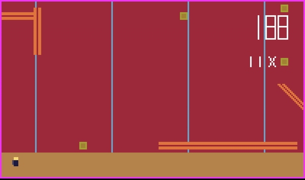
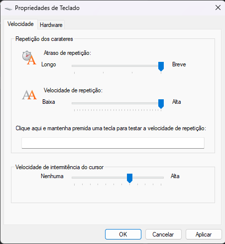

## LDTS_T11_G10 - Jetpack FEUPride

Jetpack Feup Ride is a game inspired by the famous Jetpack JoyRide. It can give the user the nostalgic feeling of playing the good old Jetpack Joyride.
>We hope you enjoy. Dev by Filipe Gaio and Tomás Esteves
> 
### CONTROLS 🎮

* **ArrowUp & Space** - (while pressed) Activate the jetpack and player goes up;
* **'q'** - Screen will close and game will stop (quit);
* **ArrowDown** - Game will stop for 2 seconds and will display player´s info;

### Mockup of the game

### Suggestion for better game experience

This game uses inputs from the keyboard as we discussed. But since keeping pushed a key on the keyboard won't "spam" it right away you have to wait for a default delay caused by the operative system. You can disable it easily on control panel on the keyboard section by just dragging the delay cursor all the way to quick (both in windows and linux).

> This game also has a Soundtrack that was produced and composed by Filipe Gaio and the game also provides some sound efx so make sure you have the sound turned on

+ There's also another ReadMe file in src/main/java that contains detailed and more specific information about the game.
