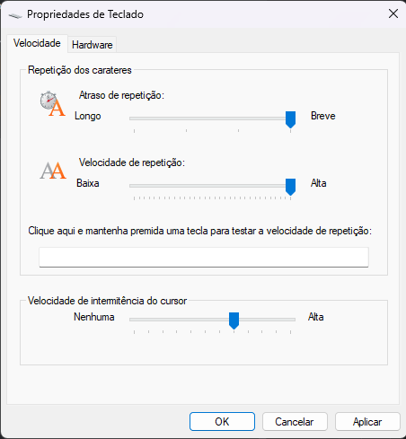
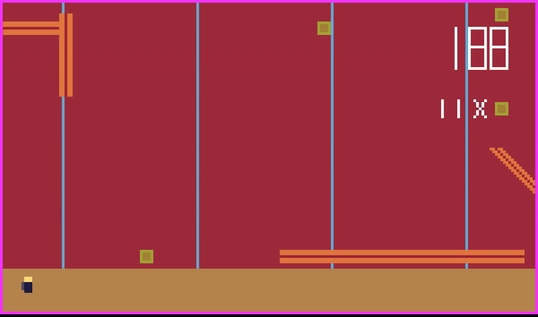
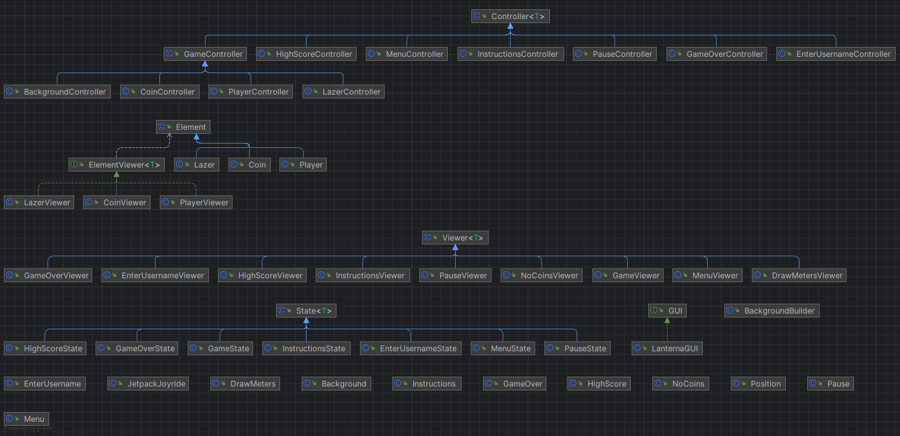
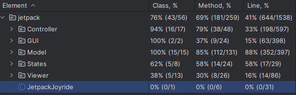
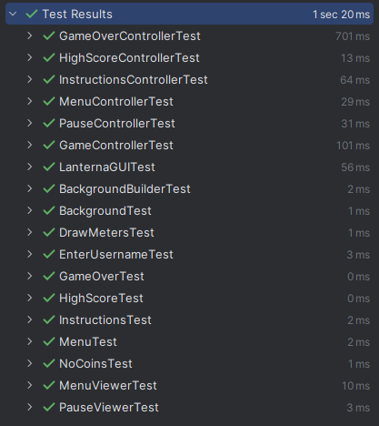
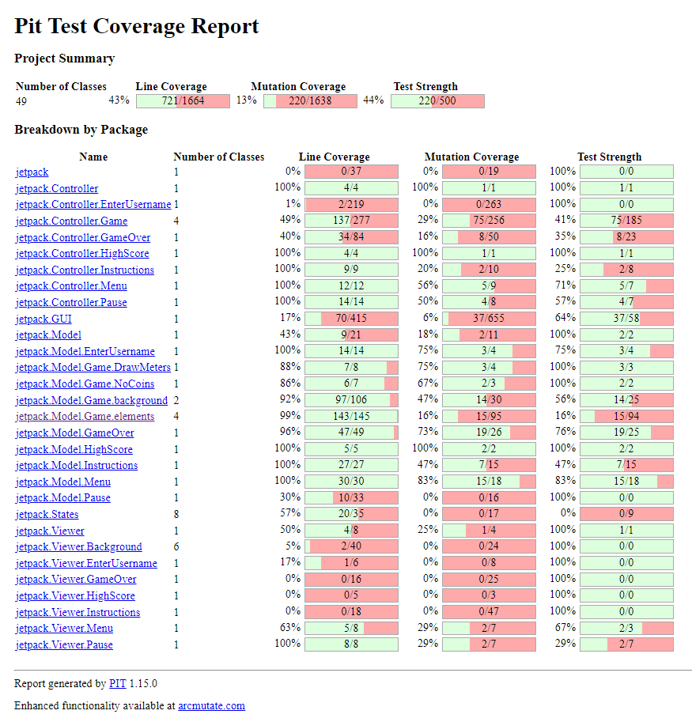

# LDTS_T11_G10 - Jetpack FEUPride

Jetpack Feup Ride is a game inspired by the famous Jetpack JoyRide. It can give the user the nostalgic feeling of playing the good old Jetpack Joyride.

* ********
### Final delivery report

In this final report we will get into the desired topics such as, Implemented features (Controls and game basics), Design patters used, code structures, code smells and testing related information.
> This project initially was inteded to be developed by 3 students. However, Carlos Miguel left the group and didn't show up to classes and scheduled group meetings. Therefore, this game was only developed by two students (Filipe Gaio & Tomás Esteves) which made the work unevenly distributed amongst the team members. 

* ********
### IMPLEMENTED FEATURES

* **Thrusters** - Play jetpack flies when Space or Arrow Up keys are pressed;
* **Lasers** - 20 different types of lasers show up, and the player loses upon colliding with them;
* **Collisions** - When the player passes through a laser a collision is detected;
* **Meters counter** - A counter counts how many meters has the player traveled;
* **Coins** - As well as lasers, coins appear on the screen when the player can and should try to catch them;
* **Coins counter** - Similarly to meters counter, coins counter display the total n of coins that the player caught;
* **Levels** - For each 100 meters run an animation appears and more lasers appear;
* **Menu** - An initial menu with the following three options;
* **Start Game** - By pressing start game you'll be redirected to a window were you are asked to write your GamerName and after pressing enter the game shall start;
* **HighScores** - A window that contains the scores of the previous player preceded by their username;
* **Instruction's Menu** - A window that has all the information about the game, how you should play, its objectives and how score is calculated;
* **Score** - Player's score is calculated based on traveled meters and coins caught (meters + 10 * coins);
* **Pause Menu** - While playing, pressing 'Esc' or 'p' will stop the game and display a window with some options. Pressing one of the keys again will resume the game from the point where the player left it;
* **Game Over** - When the player collides with a laser a GameOver Screen will appear and will show you your total score. It will also add the table os scores your username followed by your score;
* **CSV file** -  All the scores are saved in a CSV file so that when you reopen the game your score remains on the table;

* ********
### Project Design (Design Patterns and code Structure)

+ Our project was build on top of the MVC Design Pattern (Model, View, Controller)
>Since we are working with Lanterna, a console text GUI library for Java we also created a some classes in the GUI package that are responsible for drawing/printing information on the screen.
+ We also have a package named STATES that is meant to implement the State design pattern in a form of a FSM (finite state machine)
>The program starts in the MenuState which can take the user into 3 another states the EnterUsernameState, the InstructionsState and the HighScoreState and each of these can go back to the menu state. In the EnterUserNameState we can move to the GameState where we can move to two different States, the PauseState and the GameOverState. From these two states we can either go back to the GameState or to the MenuState. Finally we can end our FSM at the MenuState by closing the program.
+ Template method is another Design Pattern implemented in our project
> We decided to create some templates so that the base class might define common methods utilized by different specific classes. Those base classes are 'Element' and then player, coin and lazer extend Element, 'Viewer' and then all classes inside Viewer package extend base 'Viewer' and 'State' that is extended by all 7 States.
+ The known Singleton Design Pattern was also implemented for our player
> The idea behind using the Singleton pattern for the player is to have a globally accessible, single instance of the player object. This guarantees that any part of the code interacting with the player will always refer to the same instance, maintaining consistency in the player's data and state across the entire application.

### CONTROLS 🎮

* **ArrowUp & Space** - (while pressed) Activate the jetpack and player goes up;
* **'q' & 'Esc'** - Pause/Quit the game;
* **Extra information explained in the instructions' menu**;

### Suggestion for better game experience

This game uses inputs from the keyboard as we discussed. But since keeping pushed a key on the keyboard wont "spam" it right away you have to wait for a default delay caused by the operative system. You can disable it easily on control panel on the keyboard section by just dragging the delay cursor all the way to quick (both in windows and linux).

### Mockup of the game

### UML of the project

### TESTING

#### To make sure our game works smoothly, we did some testing using some of the tools that we have been studying. Our tests focus on the developers part in a way that we dont test exhaustively lanterna related method. We decided to focus on Controller and Model methods as it is visible on the test coverage.
+ JUnit, helped us check each small part of our code, like the bits that control the game and handle information for example our player's physics.

+ Mockito, was helpful for pretending and trying different things in our tests without actually doing such as creating a "virtual" background. Also very helpful when testing laternaGUI related methods. 

+ JQuick, is a simple way to do tests for a variety of values such as testing meters and actions. 

### Self-evaluation

- Filipe Gaio : 50%
- Tomás Esteves : 50%
